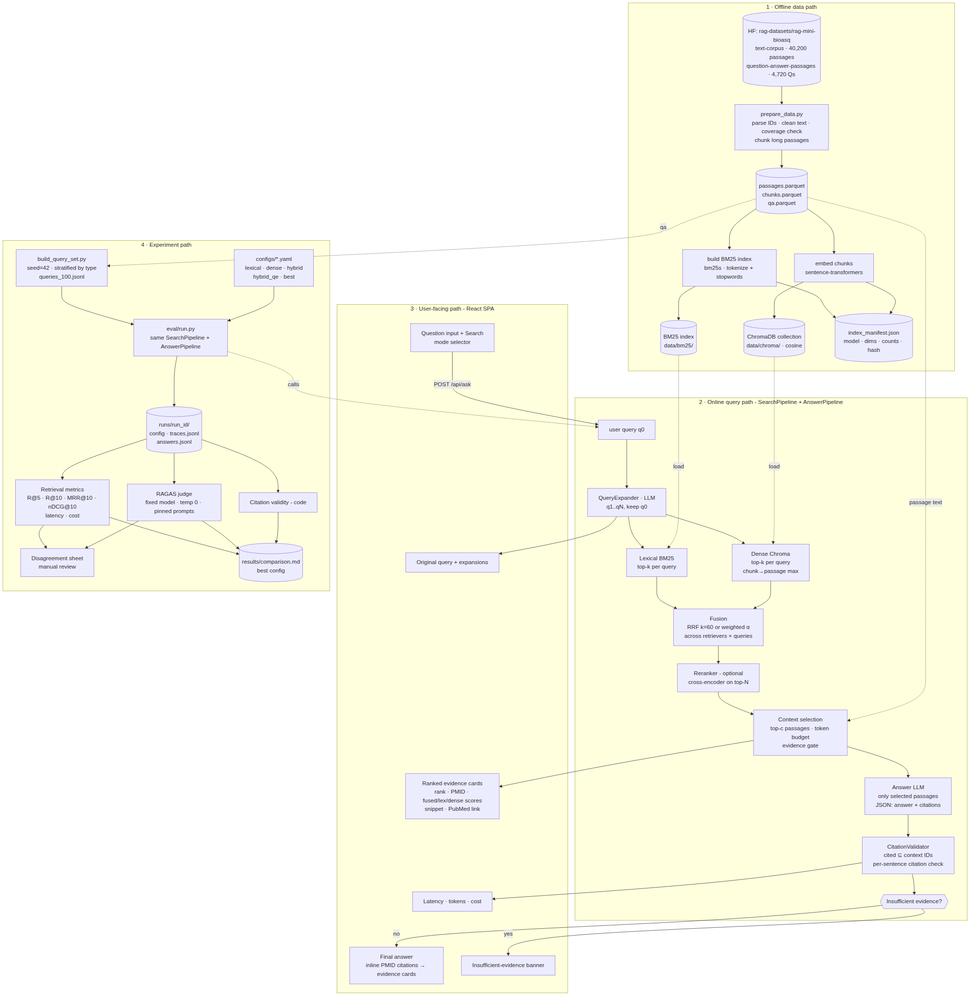

# Biomedical Hybrid Search

A small RAG application over [`rag-datasets/rag-mini-bioasq`](https://huggingface.co/datasets/rag-datasets/rag-mini-bioasq):
lexical (BM25), dense and hybrid retrieval with LLM query expansion; a UI that shows the evidence and a cited answer (or an
explicit "insufficient evidence" state); and a reproducible offline evaluation on a fixed 100-query set.

- **Results and best configuration:** [REPORT.md](REPORT.md) and [results/comparison.md](results/comparison.md)
- **Design docs:** [docs/PRD.md](docs/PRD.md), [docs/ARCHITECTURE.md](docs/ARCHITECTURE.md), [docs/SYSTEM_DESIGN.md](docs/SYSTEM_DESIGN.md)
- **System-design diagram:** [docs/system-design.svg](docs/system-design.svg) (offline data, online query, user-facing and experiment paths)



## Quick start

Requires Python 3.10+, Node 18+, and an [OpenRouter](https://openrouter.ai) key for the LLM steps (query expansion, answers, judge).
Retrieval alone (BM25, dense, hybrid) needs no key.

```bash
git clone https://github.com/dhanushvaranasi-alpha/biomedical-hybrid-search.git && cd biomedical-hybrid-search
python -m venv .venv && source .venv/bin/activate
make setup                 # python deps + frontend deps
cp .env.example .env       # then paste your OPENROUTER_API_KEY into .env
make data                  # download the two parquet files (~26 MB) and prepare them
make index                 # build BM25 + Chroma indexes (one-time; ~1 hour on 2 CPU cores, resumable)
make api                   # terminal 1: FastAPI on :8000
make ui                    # terminal 2: React UI on http://localhost:5173
```

In the UI, pick a mode (the default `best` uses query expansion, so it needs the key; `lexical`, `dense` and `hybrid` work without one and
without "Generate answer"). Every result links to its PubMed page; citations in the answer are clickable and jump to the evidence card.

## Reproduce the evaluation

```bash
make test   # 25 unit tests, no network or LLM calls
make eval   # evaluate (5 configs x 100 queries, answers + RAGAS judge) -> latency -> results/comparison.md
```

`make eval` costs about $3.3 in OpenRouter credit for a cold run (measured: $3.30). Every LLM response is cached in `.cache/llm_cache.sqlite`,
so a re-run is free, and a hard spending cap (`LLM_BUDGET_USD`, default $8, persisted across runs) is checked before every call.
The fixed query set is `eval/queries_100.jsonl` (seed 42, stratified over six question types); tuning used a disjoint set,
`eval/dev_200.jsonl`. Per-query results for every run are committed under `results/runs/`.

## Main design choices

| Choice | What we use | Why |
|---|---|---|
| Lexical index | `bm25s` (k1=1.2, b=0.75, English stopwords + stemming) over whole passages | Fast, on-disk, exact biomedical terms and names match well |
| Vector database | ChromaDB (persistent, cosine) over 48,605 sentence-aware chunks (<=180 words), scores max-pooled back to passages | Embedded, no server; long abstracts do not dilute the embedding |
| Embedding model | `BAAI/bge-small-en-v1.5` (384-d, CPU) | Small and fast; a domain model was not tried (see report limitations) |
| Fusion | **Best config:** weighted min-max fusion, alpha=0.4 on dense, across the original query (weight 1.0) and 3 LLM alternates (0.5 each). RRF (k=60) is the baseline `hybrid` | Chosen on a disjoint 200-query dev set; plain RRF did not beat BM25 |
| Query expansion | `openai/gpt-6-luna` via OpenRouter, 3 alternates, original always kept | Cheap (about $0.004 per 100 queries) |
| Final-answer model | `openai/gpt-6-luna` via OpenRouter, temperature 0, JSON output, top-5 passages only | Cheapest capable model; instructed to answer only from the passages |
| Judge | RAGAS 0.4.3 `AnswerAccuracy`, `Faithfulness`, `ContextRelevance` with `google/gemini-3.8-flash` (different vendor from the answerer), fixed prompts and settings | Same judge for every run |
| Where citations are validated | `backend/app/generation/citations.py`, called by `generation/answer.py`, which both the API and the evaluation use | One code path: cited PMIDs must be in the context given to the model; invalid ones are removed and counted; an answer left with no valid citation becomes "insufficient evidence" |

## Layout

```
backend/app/   retrieval/ (lexical, dense, fusion, expansion, pipeline)  generation/ (prompts, answer, citations)  llm/ (cached, capped client)  main.py (API)
frontend/      React + Vite UI            scripts/  download, prepare, build indexes
eval/          query set, metrics, evaluate, judge, latency, report, dev sweeps       configs/  named retrieval configs
results/       comparison table, review sheet, per-run outputs, dev tuning notes     tests/    unit tests
```

## Data notes

- 12,244 of the 40,221 passages are empty placeholders (`"nan"`), so 27,977 are indexed. 333 of 4,719 questions have no non-empty
  relevant passage and are excluded; all metrics use only non-empty relevant passages. See `data/prep_report.json` after `make data`.
- The mini corpus is the union of the relevant passages of all questions, so retrieval is easier than on an open corpus.
- Research demo, not medical advice.
