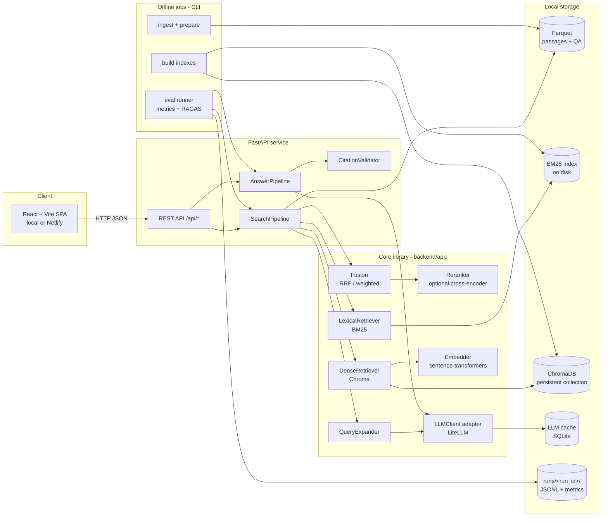

# Architecture — Biomedical Hybrid Search

| | |
|---|---|
| **Status** | Draft v0.1 |
| **Date** | 2026-09-30 |
| **Related** | [PRD.md](./PRD.md) · [SYSTEM_DESIGN.md](./SYSTEM_DESIGN.md) |

This document describes **what the components are, how they fit together, and why each technology was chosen**. Detailed data flows, schemas, algorithms and APIs live in [SYSTEM_DESIGN.md](./SYSTEM_DESIGN.md).

---

## 1. Architectural principles

1. **One pipeline, two callers.** The FastAPI service and the offline evaluation runner call the *same* `SearchPipeline` / `AnswerPipeline` code. Evaluation measures exactly what the UI serves.
2. **Configuration over code.** Every experiment is a YAML config (retriever mode, k, fusion, expansion, reranker, models). A config hash becomes the run ID.
3. **Provider-agnostic LLM.** All LLM calls (expansion, answer, judge) go through a single `LLMClient` adapter. Provider and model are set in config/env.
4. **Evidence first, answer second.** The answer model only sees selected passages; citations are validated in code before anything reaches the user.
5. **Offline heavy, online light.** Chunking, embedding and index building happen once offline; the online path only encodes the query and searches.
6. **Log everything.** Each search emits a structured trace (queries, IDs, scores, timings, tokens) usable by both the UI and the evaluator.

## 2. High-level view



## 3. Components

| Component | Responsibility | Key tech |
|---|---|---|
| **Data prep** (`scripts/prepare_data.py`) | Download both HF subsets, parse `relevant_passage_ids`, clean text, compute corpus coverage, chunk long passages, write Parquet. | `datasets`, `pandas`, `pyarrow` |
| **Index builder** (`scripts/build_indexes.py`) | Build BM25 index and Chroma collection over the **same** passage IDs; write an index manifest (model, dims, counts, hash). | `bm25s`, `chromadb`, `sentence-transformers` |
| **QueryExpander** | Produce N alternate queries (synonyms, abbreviation expansions, rephrasings) + keep original; cached. | `LLMClient` |
| **LexicalRetriever** | BM25 top-k with scores. | `bm25s` |
| **DenseRetriever** | Encode query, search Chroma, aggregate chunk hits → passage scores (max). | `sentence-transformers`, `chromadb` |
| **Fusion** | Combine ranked lists across retrievers **and** across expanded queries. RRF by default; weighted normalised score as alternative. | pure Python |
| **Reranker** (optional) | Cross-encoder rescoring of top-N fused candidates. | `sentence-transformers` CrossEncoder |
| **SearchPipeline** | Orchestrates expand → retrieve → fuse → (rerank) → select; returns a `SearchTrace`. | — |
| **AnswerPipeline** | Build grounded prompt from selected passages, call LLM with structured output, validate citations, decide insufficient-evidence. | `LLMClient`, `pydantic` |
| **CitationValidator** | Enforce cited IDs ⊆ context IDs; strip/flag invalid citations; check each claim sentence is cited. | pure Python |
| **LLMClient** | Single adapter for all LLM calls; model routing by role (`expander`, `answerer`, `judge`); token + cost accounting; disk cache. | `litellm`, SQLite cache |
| **API** | `/api/search`, `/api/answer`, `/api/ask`, `/api/configs`, `/api/health`. | `FastAPI`, `pydantic` |
| **Frontend** | Query input, expansions, evidence cards, cited answer, insufficient-evidence state, mode selector, latency/cost. | React + Vite + TypeScript |
| **Eval runner** (`eval/run.py`) | Load fixed 100-query set, run each config through the pipelines, log, score, aggregate the comparison table. | `ragas`, `pandas` |

## 4. Technology choices & rationale

| Decision | Choice | Why | Alternatives considered |
|---|---|---|---|
| Backend language | **Python 3.10+** | Retrieval, embedding and eval ecosystem is Python. | — |
| API framework | **FastAPI** | Typed request/response models, async, auto OpenAPI docs. | Flask |
| Frontend | **React + Vite + TypeScript** | Rich evidence UI, static build deployable to Netlify. | Streamlit (faster, less control) |
| Lexical | **BM25 via `bm25s`** | Fast, pure-Python, saves/loads index to disk; 40k docs is small. | `rank_bm25` (slower), Elasticsearch/OpenSearch (overkill) |
| Vector DB | **ChromaDB (persistent, local)** | Embedded, no server, persistence + metadata; cosine space. | FAISS, Qdrant |
| Embedding model | **Start: `BAAI/bge-small-en-v1.5`** (fast baseline); **candidate: MedCPT** (`ncbi/MedCPT-Query-Encoder` / `ncbi/MedCPT-Article-Encoder`, biomedical, asymmetric). Pick by a pilot on a dev slice **disjoint from the 100 eval queries**. | Balance of CPU speed vs domain fit. | `pritamdeka/S-PubMedBert-MS-MARCO`, OpenAI/other API embeddings |
| Fusion | **Reciprocal Rank Fusion (k = 60)** default; **weighted min-max score fusion (α)** as alternative. | RRF is scale-free and robust across BM25/cosine score scales. | CombSUM/CombMNZ |
| Reranker (strongest-variant candidate) | Cross-encoder, e.g. `BAAI/bge-reranker-base` or `ncbi/MedCPT-Cross-Encoder` | Usually lifts top-of-list precision (nDCG/MRR); to be confirmed by experiment. | LLM reranking (costly) |
| LLM access | **LiteLLM** behind own `LLMClient`, routed through **OpenRouter** (single `OPENROUTER_API_KEY`, model strings `openrouter/<vendor>/<model>`) | One key for all vendors; passes through provider pricing (5.5% fee on credit purchase); keeps the design provider-agnostic since only the model strings change. | Direct vendor SDKs / keys |
| LLM roles | `expander` + `answerer`: cheap OpenAI model (Luna tier). `judge`: Google Gemini 3.8 Flash. Set via `LLM_EXPANDER_MODEL`, `LLM_ANSWER_MODEL`, `LLM_JUDGE_MODEL`. | Cheap model for high-volume simple work; judge from a different vendor avoids self-preference bias. Exact IDs to be confirmed on openrouter.ai/models. | Stronger judge (e.g. Claude Sonnet) at ~2–3× judging cost |
| Structured output | Pydantic schema + JSON mode / tool-call where supported, with a parse-and-repair fallback | Works across providers. | Free text + regex |
| LLM-judge | **RAGAS** (fixed judge model, temperature 0, pinned version) | Required by brief; answer correctness, faithfulness/groundedness, context relevance. | DeepEval |
| Caching | SQLite key-value cache keyed on `hash(role, model, prompt_version, input)` | Reproducibility and cost control across 5 configs. | `diskcache` |
| Experiment tracking | Plain files: `runs/<run_id>/{config.yaml, traces.jsonl, answers.jsonl, metrics.json}` + aggregated `results/comparison.csv/.md` | Transparent, diff-able, no extra service. | MLflow, W&B |
| Packaging | `uv` / `pip` with `pyproject.toml`; `npm` for frontend; `Makefile` targets | Simple reproducibility. | Poetry, Docker (optional later) |

> Every version and model name is pinned in `pyproject.toml` / config and recorded in each run's manifest.

## 5. Repository layout (planned)

```
biomedical-hybrid-search-code/
├── README.md                    # setup, run, main design choices (brief Step 5)
├── REPORT.md                    # comparison table, best config, successes/failures
├── Makefile                     # make data | index | api | ui | eval | report
├── pyproject.toml
├── .env.example                 # LLM_* keys and model names
├── docs/
│   ├── PRD.md
│   ├── ARCHITECTURE.md
│   ├── SYSTEM_DESIGN.md
│   └── system-design.png|svg    # exported diagram for submission
├── configs/
│   ├── base.yaml
│   ├── lexical.yaml  dense.yaml  hybrid.yaml  hybrid_qe.yaml  best.yaml
├── backend/
│   └── app/
│       ├── main.py              # FastAPI app
│       ├── api/                 # routers, request/response schemas
│       ├── config.py            # pydantic settings + YAML loader
│       ├── data/                # loaders for parquet/manifest
│       ├── retrieval/           # lexical.py dense.py fusion.py rerank.py expansion.py pipeline.py
│       ├── generation/          # prompts/, answer.py, citations.py
│       ├── llm/                 # client.py (LiteLLM), cache.py, pricing.py
│       └── tracing.py           # SearchTrace / timing / token accounting
├── scripts/
│   ├── prepare_data.py
│   └── build_indexes.py
├── eval/
│   ├── build_query_set.py       # stratified 100-query sample (seed fixed)
│   ├── queries_100.jsonl        # committed
│   ├── run.py                   # runs configs through the pipelines
│   ├── metrics.py               # recall@k, mrr@k, ndcg@k
│   ├── judge.py                 # RAGAS wrapper, fixed settings
│   ├── disagreements.py         # manual-review sheet
│   └── prompts/judge_*.txt
├── frontend/                    # React + Vite + TS
├── data/        (gitignored)    # parquet, bm25/, chroma/
├── runs/        (gitignored, summaries committed to results/)
├── results/                     # comparison.md/csv, review sheets
└── tests/                       # unit tests: metrics, fusion, citation validator, parsing
```

## 6. Deployment topology

| Mode | Frontend | Backend | Indexes |
|---|---|---|---|
| **Local (default — chosen for now)** | `vite dev` on :5173 (proxy `/api` → :8000) | `uvicorn` on :8000 | Local `data/` |
| **Netlify demo (optional)** | Netlify static build, `VITE_API_BASE_URL` set | Must be publicly reachable (e.g. a small container host) with indexes baked in or mounted; CORS allow-list the Netlify origin | Built once, shipped with backend |

Netlify only hosts the static frontend here; the Python backend (Chroma + embedding model) is not a Netlify function.

## 7. Cross-cutting concerns

- **Configuration**: `configs/base.yaml` + per-experiment overrides; env vars for secrets and model names; resolved config is hashed and stored with every run/trace.
- **Observability**: structured JSON logs; per-stage timings (`expand_ms`, `lexical_ms`, `dense_ms`, `fuse_ms`, `rerank_ms`, `llm_ms`); token and cost counters from `LLMClient`.
- **Reproducibility**: fixed seeds; pinned model names; LLM cache; index manifest hash checked at startup and recorded in runs.
- **Security**: keys in `.env` only; CORS restricted; input length limit on queries; passages are rendered as text (no HTML injection).
- **Testing**: unit tests for metric functions (against hand-computed examples), fusion, citation validation, ID parsing; a smoke test that runs 5 queries end-to-end.

## 8. Key risks (architecture-level)

| Risk | Architectural response |
|---|---|
| Eval and app drift apart | Shared pipeline classes; eval imports from `backend/app`. |
| Provider lock-in / key availability | `LLMClient` adapter + LiteLLM model strings in config. |
| Embedding choice changes index | Index manifest stores model + dims; startup refuses mismatched config. |
| Long runtime of 5×100 runs with LLM calls | Caching; expansions computed once and shared by all QE configs; concurrency limit in runner. |
