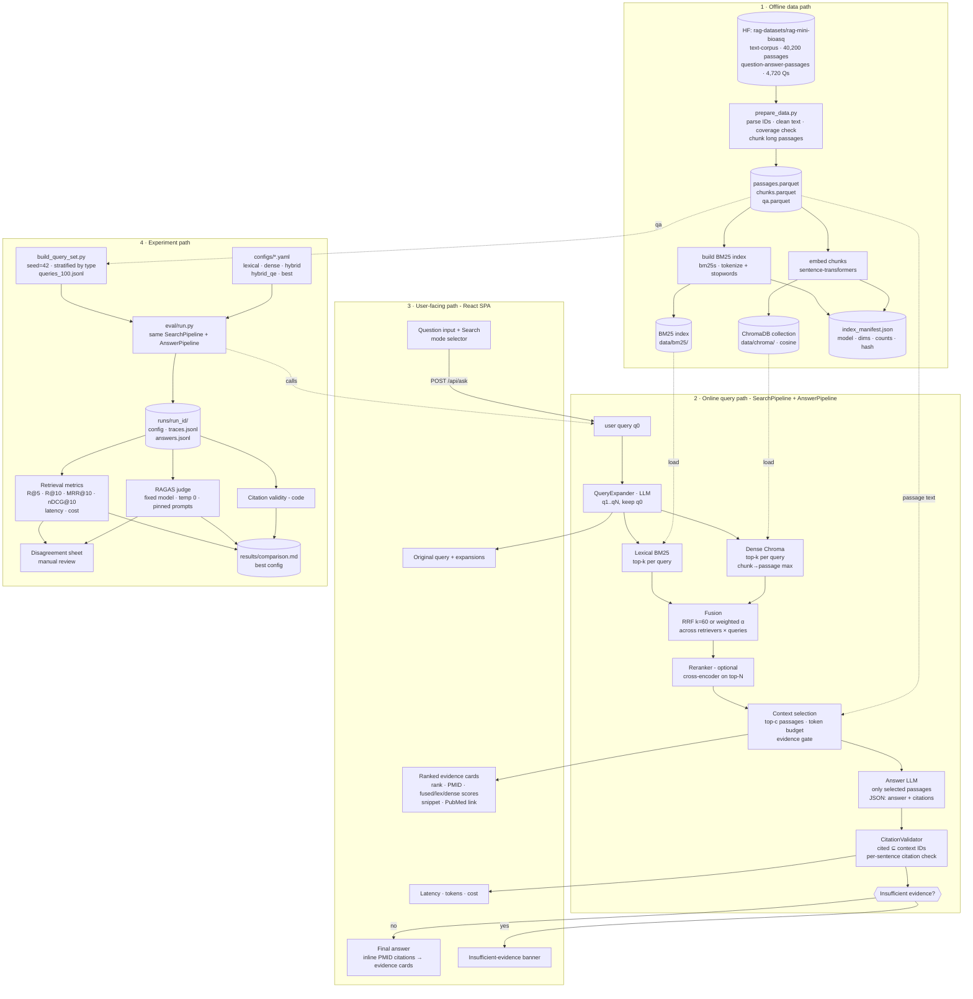

# System Design — Biomedical Hybrid Search

| | |
|---|---|
| **Status** | Draft v0.1 |
| **Date** | 2026-09-30 |
| **Related** | [PRD.md](./PRD.md) · [ARCHITECTURE.md](./ARCHITECTURE.md) |

This document covers the four paths the brief asks the diagram to show — **offline data**, **online query**, **user-facing**, **experiment** — plus data models, algorithms, APIs and evaluation details.

---

## 1. System-design diagram (Brief Step 5)



> For the submission, this diagram is also exported to `docs/system-design.svg` (e.g. with `mmdc`) so it renders anywhere.

---

## 2. Offline data path

### 2.1 Load & parse

| Step | Detail |
|---|---|
| Load | `datasets.load_dataset("rag-datasets/rag-mini-bioasq", "text-corpus", split="passages")` and `("…", "question-answer-passages", split="test")`. |
| Parse gold IDs | `relevant_passage_ids` is a string like `"[20598273, 6650562]"` → `ast.literal_eval` → `list[int]`. |
| Clean | Normalise whitespace; **drop empty placeholder passages (< 20 chars: `"nan"`, `"1."` — 12,244 of 40,221)**, counted in `data/prep_report.json`. |
| Coverage check | For every question: `gold_in_corpus = gold ∩ non-empty passage IDs`. **Eval only uses questions with ≥1 usable gold (4,386 of 4,719), and metrics use `gold_in_corpus`.** |
| Question type | Rule-based classifier (see §6.1) stored as `qtype`. |

### 2.2 Chunking (dense index only)

- BM25 indexes the **full passage** (one doc per PMID).
- Dense: passages ≤ `max_tokens` (default 256 model tokens) → one chunk; longer ones → sliding windows of 256 tokens, 32-token overlap, sentence-boundary aware.
- Chunk ID: `"{pmid}:{chunk_idx}"`; metadata `{pmid, chunk_idx, n_chunks}`.
- Passage score = **max** over its chunk scores (configurable: `max` | `mean_top2`).

### 2.3 Indexes

| Index | Build | Stored |
|---|---|---|
| BM25 | `bm25s` with lowercase, English stopwords, simple tokenization keeping alphanumerics and hyphenated tokens (gene names like `IL-6`, `BRCA1`). Params `k1=1.2, b=0.75` (tunable). | `data/bm25/` |
| Dense | `sentence-transformers` model from config; normalised embeddings; batch encode; Chroma `PersistentClient`, collection `passages_<model_slug>`, cosine space. For asymmetric models (MedCPT) use article encoder for docs, query encoder for queries. | `data/chroma/` |
| Manifest | `{dataset_revision, n_passages, n_chunks, embed_model, dims, bm25_params, tokenizer, built_at, sha}` | `data/index_manifest.json` |

Startup check: the API and eval runner load the manifest and refuse to run if the configured embedding model ≠ manifest.

---

## 3. Online query path

### 3.1 Query expansion

- **Input**: `q0`. **Output**: `[q0, q1, …, qN]`, default `N = 3`.
- Prompt (versioned `expansion_v1`) asks for: expanded abbreviations, synonyms / MeSH-style terms, one paraphrase; **no new facts, no answers**; JSON list output.
- Dedupe (case-folded), drop empties, cap length.
- Weighting in fusion: `w(q0) = 1.0`, `w(qi) = 0.5` by default (config `expansion.orig_weight`, `expansion.alt_weight`).
- Cached by `(model, prompt_version, q0)`; the eval reuses the same cached expansions for every QE config.

### 3.2 Retrieval

For each query `qj` and each active retriever `r ∈ {lex, dense}`: fetch top `k_retrieve` (default 50) → ranked list `L(r, qj)` of `(pmid, score)`.

### 3.3 Fusion

**RRF (default)**

```
score(d) = Σ_r Σ_j  w_r · w_qj · 1 / (k_rrf + rank_{r,qj}(d))        k_rrf = 60
```

**Weighted score fusion (alternative)**

```
s_r(d) = min-max normalise score within L(r, qj)   (missing → 0)
score(d) = Σ_j w_qj · ( α · s_dense(d) + (1-α) · s_lex(d) )
```

Modes map onto this: `lexical` → only lex; `dense` → only dense; `hybrid` → both, `q0` only; `hybrid_qe` → both, all queries.

Each fused result keeps component info for the UI and logs: `{pmid, fused_score, lex_rank, lex_score, dense_rank, dense_score, matched_queries}`.

### 3.4 Re-ranking (optional, strongest-variant candidate)

Cross-encoder scores `(q0, passage_text)` for top `N_rerank` (default 30) fused candidates; final order by reranker score (or a blend with fused score, configurable). Reported separately in latency.

### 3.5 Context selection & evidence gate

- Take top `c` passages (default 5) within a token budget (default ~3k tokens); long passages truncated around the best-matching chunk.
- **Evidence gate** (pre-LLM): if the top result's evidence signal is below a threshold (reranker score if reranking is on; otherwise no hit from both retrievers in the top 10), mark `low_evidence=true`. The LLM is still called but told explicitly it may answer "insufficient evidence". Thresholds are tuned on a dev slice, not on the eval 100.

### 3.6 Answer generation

Prompt `answer_v1` (system):

- Answer **only** using the passages below. Each passage is labelled `[PMID:<id>]`.
- Every factual sentence must end with one or more citations `[PMID:<id>]` drawn from the labels.
- If the passages do not contain enough information, set `insufficient_evidence=true` and give a short explanation of what is missing.
- Do not use outside knowledge. Be concise; for yes/no questions, start with Yes/No.

Output (JSON, temperature 0):

```json
{"insufficient_evidence": false,
 "answer": "Yes. Papilin is a secreted extracellular matrix protein [PMID:21784067]."}
```

Sentence splitting and per-sentence citation checks are done in code (`generation/citations.py`), not by the model, which keeps the model's job simple and the validation independent of it.

Settings: temperature 0, max tokens bounded, provider JSON mode where available; on parse failure → one repair attempt → otherwise insufficient-evidence with `error="parse_failed"`.

### 3.7 Citation validation (enforced in code — `generation/citations.py`)

This is the single place citation correctness is enforced, used by both the API and eval.

1. Parse citations from the answer text with a regex over `[PMID:123, PMID:456]` groups.
2. `valid = cited ∩ context_ids`; `invalid = cited − context_ids`.
3. Invalid citations are **removed** from the displayed answer and counted.
4. Sentences with no remaining valid citation are flagged `uncited`.
5. Final state:
   - `insufficient_evidence` if the model said so, **or** no valid citations remain, **or** > 50 % of sentences are uncited.
   - otherwise `answered`, with `citation_valid_rate`, `invalid_ids`, `uncited_sentences` in the response.
6. Metrics logged per answer: `n_citations`, `n_invalid`, `citation_precision_vs_gold` (cited ∩ gold / cited — informational).

---

## 4. User-facing path

### 4.1 API

| Method | Path | Body / Query | Returns |
|---|---|---|---|
| `GET` | `/api/health` | — | status, manifest summary |
| `GET` | `/api/configs` | — | available named configs (`lexical`, `dense`, `hybrid`, `hybrid_qe`, `best`) |
| `POST` | `/api/search` | `{query, config?: name, overrides?: {...}}` | `SearchResponse` (no LLM answer) |
| `POST` | `/api/ask` | same as search | `SearchResponse` + `AnswerResponse` |
| `GET` | `/api/passages/{pmid}` | — | full passage text + PubMed URL |

**`SearchResponse`**

```json
{
  "trace_id": "…",
  "config": {"name": "best", "hash": "a1b2c3"},
  "query": "Is the protein Papilin secreted?",
  "expansions": ["papilin secretion extracellular matrix", "…"],
  "results": [
    {"rank": 1, "pmid": 21784067, "score": 0.0487,
     "lexical": {"rank": 1, "score": 18.2}, "dense": {"rank": 3, "score": 0.71},
     "rerank_score": 7.9, "matched_queries": [0, 2],
     "snippet": "…", "source_url": "https://pubmed.ncbi.nlm.nih.gov/21784067/",
     "selected_for_context": true}
  ],
  "timings_ms": {"expand": 820, "lexical": 12, "dense": 35, "fuse": 1, "rerank": 210, "total": 1080}
}
```

**`AnswerResponse`**

```json
{
  "status": "answered | insufficient_evidence",
  "answer": "…[PMID:21784067]…",
  "sentences": [{"text": "…", "citations": [21784067], "uncited": false}],
  "citations": {"valid": [21784067], "invalid": [], "valid_rate": 1.0},
  "reason": null,
  "usage": {"prompt_tokens": 1450, "completion_tokens": 90, "cost_usd": 0.0004},
  "timings_ms": {"llm": 1900}
}
```

### 4.2 UI (React + Vite + TS)

| Area | Behaviour |
|---|---|
| Header | Title + "Research demo — not medical advice". |
| Search bar | Text input (max ~500 chars), Search button, mode dropdown (default `best`), sample-question chips. |
| Query panel | Original query highlighted; expansions as chips. |
| Answer panel | Answer text; `[PMID:x]` rendered as clickable superscript chips that scroll to and highlight the evidence card; validation badge (e.g. "3/3 citations valid"). |
| Insufficient-evidence state | Amber banner: "Not enough evidence in the retrieved passages to answer." + reason; evidence list still shown. |
| Evidence list | Cards: rank, PMID, fused score, lexical/dense ranks & scores, rerank score, "used in answer" tag, snippet with query-term highlighting, expand to full text, PubMed link. |
| Footer meta | Per-stage latency, tokens, estimated cost, config hash. |
| States | loading skeletons, API error toast, empty-query validation. |

Search and answer are fetched as `/api/ask`; optional enhancement: call `/api/search` first to render evidence quickly, then `/api/ask` for the answer.

---

## 5. Data models

```python
class Passage(BaseModel):
    pmid: int
    text: str

class Chunk(BaseModel):
    chunk_id: str          # "pmid:idx"
    pmid: int
    idx: int
    text: str

class QAItem(BaseModel):
    qid: int
    question: str
    answer: str
    gold_pmids: list[int]          # parsed
    gold_in_corpus: list[int]      # intersected with corpus
    qtype: Literal["yesno","definition","list","treatment","mechanism","effect","other"]

class RetrievalConfig(BaseModel):
    name: str
    mode: Literal["lexical","dense","hybrid"]
    expansion: ExpansionCfg        # enabled, n, orig_weight, alt_weight, model
    k_retrieve: int = 50
    fusion: FusionCfg              # method: rrf|weighted, k_rrf=60, alpha=0.5
    rerank: RerankCfg              # enabled, model, top_n=30
    context: ContextCfg            # top_c=5, token_budget=3000
    answer: AnswerCfg              # model, prompt_version, temperature=0

class SearchTrace(BaseModel):
    trace_id: str; run_id: str | None; qid: int | None
    config_hash: str
    query: str; expansions: list[str]
    per_retriever: dict[str, list[tuple[int, float]]]   # per query too
    fused: list[FusedHit]
    timings_ms: dict[str, float]
    usage: dict[str, int | float]
```

---

## 6. Experiment path

### 6.1 Building the fixed 100-query set (`eval/build_query_set.py`)

1. Keep questions with ≥1 `gold_in_corpus`.
2. Classify `qtype` with ordered rules (first match wins), e.g.:
   - **yesno**: starts with `is|are|does|do|can|could|was|were|has|have|should|will`
   - **list**: starts with `list|which|name` or contains `what are the`
   - **treatment**: contains `treat|therapy|drug for|management of`
   - **mechanism**: contains `mechanism|how does|pathway|mode of action`
   - **effect**: contains `effect of|effect on|impact|affect|associated with`
   - **definition**: starts with `what is|what are|define|describe`
   - else **other**
3. Spot-check a sample of labels manually; fix rules if needed (log changes).
4. Stratified sample, `seed=42`: target ~17 per type across the 6 types, backfilling from the largest types where a type is short. Record actual counts in the report.
5. Write `eval/queries_100.jsonl` (committed) + `eval/queries_100.meta.json` (seed, rules version, counts, dataset revision). Every run uses exactly these 100 `qid`s.

### 6.2 Configurations

| Config | mode | expansion | fusion | rerank |
|---|---|---|---|---|
| `lexical` | lexical | off | — | off |
| `dense` | dense | off | — | off |
| `hybrid` | hybrid | off | RRF k=60 | off |
| `hybrid_qe` | hybrid | on (N=3) | RRF k=60 | off |
| `best` (candidate) | hybrid | on | RRF or weighted α (tuned) | cross-encoder top-30 |

`best` is chosen from a small sweep (fusion method, α, k_rrf, N, rerank on/off, embedding model) evaluated on a **dev slice disjoint from the 100** to avoid tuning on the test set; the final pick is then run once on the 100.

### 6.3 Runner (`eval/run.py`)

```
python -m eval.run --configs lexical dense hybrid hybrid_qe best \
                   --queries eval/queries_100.jsonl --answer --judge
```

- `run_id = f"{config.name}-{config_hash[:8]}-{timestamp}"`.
- For each query: `SearchPipeline.run()` → trace; if `--answer`: `AnswerPipeline.run()`.
- Writes `runs/<run_id>/config.yaml`, `traces.jsonl`, `answers.jsonl`, `metrics.json`, `env.json` (package versions, models, manifest hash).
- Bounded concurrency for LLM calls; cache makes reruns cheap and deterministic.

### 6.4 Metrics

Let `G` = `gold_in_corpus`, ranked list `R` (top 10 PMIDs, binary relevance).

| Metric | Definition |
|---|---|
| Recall@k (k=5,10) | `|R[:k] ∩ G| / |G|` |
| MRR@10 | `1 / rank of first relevant in R[:10]`, else 0 |
| nDCG@10 | `DCG = Σ_{i≤10} rel_i / log2(i+1)`; `IDCG` over `min(|G|,10)` ideal hits; `nDCG = DCG/IDCG` |
| Latency | p50 / p95 of total and per stage (retrieval-only and end-to-end reported separately) |
| Cost | Σ tokens × price table in `configs/pricing.yaml` (per model, per 1M tokens), split into expansion / answer / judge |
| Citation validity | % answers with 0 invalid IDs; mean valid-rate; % insufficient-evidence |

All metrics are macro-averaged over the 100 queries, and also broken down by `qtype`.

### 6.5 LLM-judge (`eval/judge.py`)

- Framework: **RAGAS**, version pinned.
- Metrics: answer correctness (vs dataset `answer`), faithfulness/groundedness (answer vs selected contexts), context relevance/precision (contexts vs question). Exact RAGAS metric classes are pinned to the installed version and listed in the report.
- Judge model fixed via config (`judge.model`), temperature 0, same prompts and settings for every run; judge outputs cached by `(judge_model, ragas_version, qid, answer_hash, contexts_hash)`.
- Insufficient-evidence answers are scored and also reported as their own bucket so they don't silently skew averages.

### 6.6 Manual review (`eval/disagreements.py`)

Produce `results/review_<config>.csv` with cases where signals disagree:

- **High retrieval, low judge**: Recall@10 ≥ 0.5 but correctness/faithfulness < 0.5 → likely generation problem.
- **Low retrieval, high judge**: Recall@10 = 0 but correctness ≥ 0.7 → gold-label gaps or relevant non-gold passages.
- Any answer with invalid citations or `parse_failed`.

Columns: qid, qtype, question, gold answer, model answer, cited IDs, gold IDs, top-10 IDs, metrics, reviewer verdict, notes. Review ≥10 rows; summarise findings in the report.

### 6.7 Report output

`results/comparison.md` (the single comparison table):

| Config | R@5 | R@10 | MRR@10 | nDCG@10 | Correct. | Faithful. | Ctx rel. | Cit. valid % | p50 / p95 ms | $ / 100 q |
|---|---|---|---|---|---|---|---|---|---|---|
| lexical | | | | | | | | | | |
| dense | | | | | | | | | | |
| hybrid | | | | | | | | | | |
| hybrid_qe | | | | | | | | | | |
| best | | | | | | | | | | |

`REPORT.md` then states: what won, why (per-qtype breakdown + examples), latency/cost trade-off, 3 successes, 3 failures, and the final `configs/best.yaml`.

---

## 7. Performance & capacity

| Item | Estimate (to be measured) |
|---|---|
| Corpus | 40,200 passages; chunks > passages due to long ones — count reported by data prep. |
| Embedding build | One-time; CPU feasible with a small model, faster on GPU/MPS. |
| Memory | BM25 + Chroma for ~40k–60k vectors fits comfortably on a laptop. |
| Online retrieval | BM25 and ANN search are milliseconds at this scale; query encoding and optional reranking dominate non-LLM latency. |
| LLM calls per `/ask` | 1 (expansion, if on, cached) + 1 (answer). Eval adds judge calls. |

Numbers above are expectations, not measurements; the report will use measured values only.

## 8. Failure handling

| Failure | Behaviour |
|---|---|
| Expansion LLM error/timeout | Fall back to `[q0]`, flag `expansion_failed` in trace/UI. |
| Dense or lexical retriever error | Continue with the other in hybrid; flag degraded mode. |
| Answer LLM error | Return evidence + `status="error"`; UI shows evidence with retry. |
| JSON parse failure | One repair attempt → else insufficient-evidence with reason. |
| All citations invalid | Insufficient-evidence (never show uncited answer as answered). |
| Manifest mismatch | Refuse to start with clear message. |

## 9. Testing strategy

- **Unit**: ID parsing, tokenizer, RRF/weighted fusion on toy lists, Recall/MRR/nDCG against hand-computed cases, citation validator (valid, invalid, missing, mixed), qtype rules.
- **Integration**: build indexes on a 500-passage sample; run `/api/ask` with a mocked LLM.
- **Smoke eval**: 5 queries × all configs with real models before the full run.
